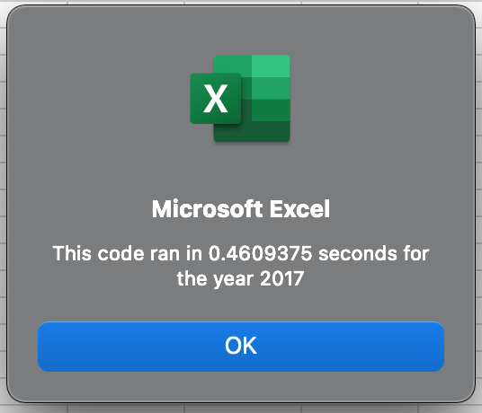
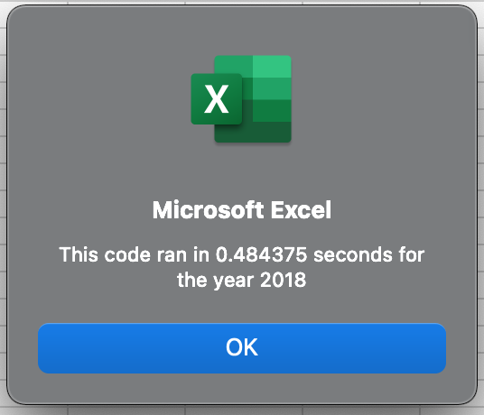

# stock-analysis

## Overview of the Analysis

In this analysis we took years of stock data and used VBA to run a script and analyze the stock data.
We determined if the stock price rose or fell between the years.

## Results

## Summary

The advantages of refactoring code is that the process of running an analyzation or finding your solution is much quicker than writing code from scratch. The disadvantages would be that you don't really put your skills to the test by writing the code again or yourself. If you follow the procedure of DRY then it would be smartest to refactor your code.